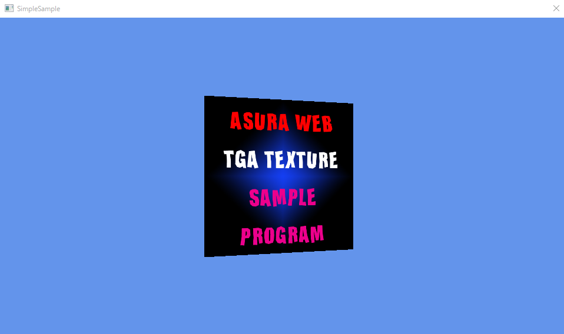

# D3D12_NvAftermath
NVIDIA Aftermath組み込みサンプルプログラム.

キーボードでTボタンを押すとGPUクラッシュが発生し, プロジェクトディレクトリ下に，gpu_crashフォルダが作成さ，そこにGPUクラッシュダンプファイルが出力されます.  
このサンプルにはNVIDIA Aftermath SDKは付属しておりません. 各自でダウンロードしてください。動作確認には，NVIDIA_Nsight_Aftermath_SDK_2025.1.0.25009 を使用しています.  

Licence
--------------------

This software is distributed under MIT. For details, see LICENCE file.
